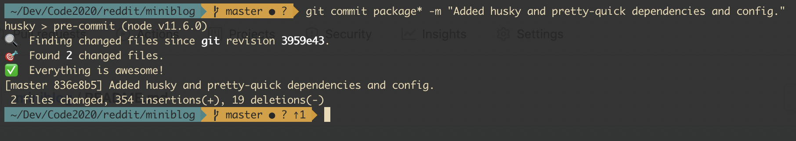
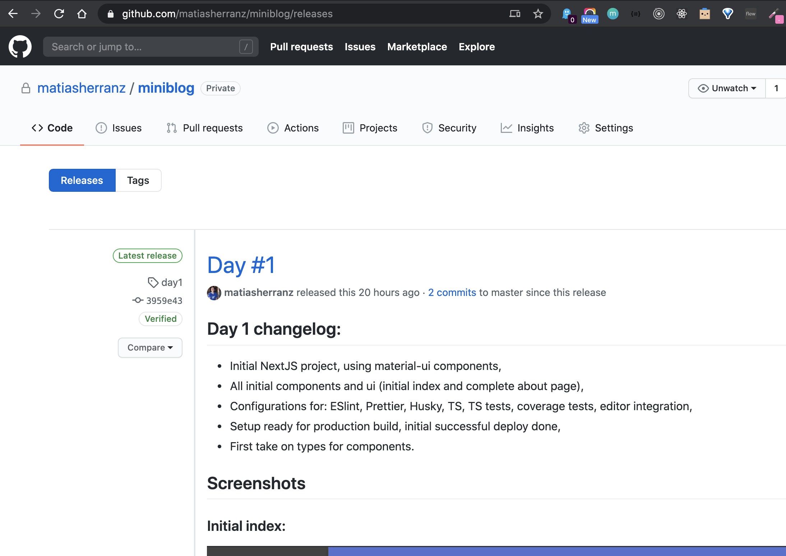

# Next.js MiniBlog (using reddit as source!)

## Tech stach used

### NodeJS
The node version used id 12 (12.9.1 to be precise). To set it, I use `nvm` like this:

```bash
$ nvm use 12.9.1
```

You can take a look [here](https://github.com/nvm-sh/nvm) to learn more about `nvm`, including setup intruction and full documentation.

One required config to make sure Typescript plays along well with our particular NodeJS version is documented [here](https://github.com/microsoft/TypeScript/wiki/Node-Target-Mapping) and implemented on the project [here](https://github.com/matiasherranz/miniblog/blob/master/tsconfig.json#L3).

### NextJS

The frontend and SSR I chose for the project is [NextJS](https://nextjs.org/).

The main reasons being:

- Very active project: 6160 commits | 825 releases | 1103 contributors as of June/2020,
- Supported by Vercel (formerly Zeit) + 8 main developers (including people from Vercel and also a Mozilla Core Developer) + a very large community,
- Official (and officially maintained) examples for right about stack any setup: official examples,
- Easy to extend configurations for NodeJS, Babel, Webpack, etc. without ejecting,
- Out of the box support for server side rendering (SSR),
- Excellent support for server-side state hydration, consuming (rest or graphql) APIs,
- Out of the box support for amp pages,
- Easy severless deployments,
- Excellent integration with Apollo,
- Excellent performance benchmarks ([reference](https://blog.logrocket.com/next-js-vs-create-react-app))
- And last but not least: Awesome developer experience!

### Typescript

- Has a free IDE, that is created and maintained by the same company/people than the language itself (VS Code),
- In 2020, TS is more well-maintained and has more people working on it: In January 2020 TypeScript had 29 contributors, Flow had 14 contributors, and there were 156 pull requests merged compared to no Flow pull requests merged
- more third-party types are available (estimated to roughly 8X),
- more libraries are written in TypeScript (naturally improving the quality of the interface types compared to reverse engineering the types)
- installing types using npm / DefinitelyTyped makes a lot of sense compared to flow-typed where type definitions are checked into your repository (and you’ll most likely forget to update them).

### UI Layout and Styles

For this project, I decided to go with Material UI, that I've been meaning to try for a while.

It is one of the best looking UI frameworks I've seen, and provides great mobile support.
It also provides a great set of components and styles, palettes, and a rather extensive set of tools that integrate perfectly with ReactJS and Typescript.

Reference on material-ui I used:
- https://github.com/mui-org/material-ui/
- https://material-ui.com/

Theming and colors:
- https://material-ui.com/customization/palette/

An interesting thing I learned while working on this project is to automatically set the dark mode on the application's theme based on the user's preference on the browser. To accomplish this I used the `useMediaQuery` hook provided by MaterialUI library in conjunction with the `useMemo` hook from react.

- You can see the project's code for this [here](https://github.com/matiasherranz/miniblog/blob/master/pages/_app.tsx#L23)
- And the references on this feature [here](https://material-ui.com/customization/palette/#user-preference).

### Development environment setup and code style considerations

The main pieces of the code styling and standard-compliance setup I used are the following:

- Editor config: ([link](https://editorconfig.org/)) EditorConfig helps maintain consistent coding styles for multiple developers working on the same project across various editors and IDEs.
- .gitignore: I used a standard .gitignore file from the [GitHub gitignore project](https://github.com/github/gitignore/blob/master/Node.gitignore),
- prettier: ([link](https://prettier.io/)) A great code formatter that smothly integrates with both editors and commit/push hooks,
- eslint: ([link](https://eslint.org/)) ESLint statically analyzes your code to quickly find problems. Many problems ESLint finds can be automatically fixed. I set it up to work side-by-side with prettier.
- husky: ([here](https://github.com/typicode/husky)) Precommit and prepush hooks integrated with ESLint and prettier:



## Development approach used

For this project I decided to try this idea: make a daily release to depict the progress I made each day on the project.

This way, the 1-day-long iterations can be seen here, listed making use of the **releases** feature from GitHub: https://github.com/matiasherranz/miniblog/releases



## Interacting with the project

### Run the project

Clone the repo:

```sh
git clone git@github.com:matiasherranz/miniblog.git
cd miniblog
```

Install the project dependencies it and run it!

```sh
npm install
npm run dev
```

Then go to [localhost:3000](localhost:3000) on your browser to see the project in action!

You can also see the project live [here](https://reddit-miniblog.vercel.app/).

### Run the project in production mode

Create a production build of the project:

```bash
npm run build
```

Then you can either run a production-like instance locally:

```bash
npm start
```

Or deploy it to a Vercel's Now server right from GitHub following [this steps](https://nextjs.org/docs/deployment).
